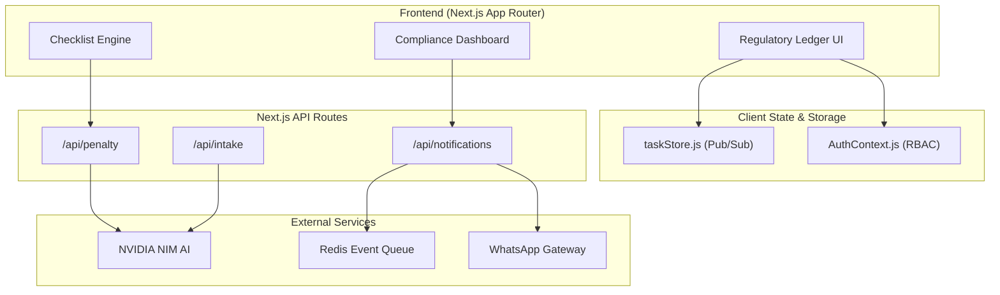

# 📜 Docket — AI-Powered Compliance & Regulatory Platform

**Docket** is an AI-powered enterprise regulatory & compliance automation platform tailored for Indian corporate governance (Companies Act 2013, CGST Act 2017, Income Tax Act 1961, EPF Act, and Labour Laws).

Designed with a **Regulatory Ledger** aesthetic (light-mode, high-contrast, slab-serif headings, and monospace audit trails), Docket caters to two distinct operational roles:
- **Tier 1 — Solo Founders**: Natural language dossier intake and progress tracking.
- **Tier 2 — Compliance Heads**: High-density command center, live statutory timelines, risk gauges, knowledge graph, and printed audit sheets.

---

## 🚀 Key Features

* **Real-Time Penalty Calculator**: Calculates statutory late fees, daily accruals, and prosecution escalation countdowns via local engines or NVIDIA NIM AI.
* **WhatsApp Reminder Gateway**: Configurable pre-filing notification dispatches (30d, 15d, 7d, 1d) with live message previews and immutable log sheets.
* **Checklist Engine Workbook**: Spreadsheet-style compliance tracker supporting 4 explicit verification statuses (`Not Started`, `Evidence Uploaded`, `Filed & Verified`, `Overdue`).
* **Dual-Tier Identity (RBAC)**: Role-based access control allowing seamless switching between founder guided intake and executive command views.

---

## 🛠️ Tech Stack

* **Frontend**: Next.js 16 (App Router), React 19, Tailwind CSS v4
* **Typography**: Fraunces (Serif), IBM Plex Sans, IBM Plex Mono
* **Backend & API**: Next.js Server Routes, Redis Event Fanout
* **AI & Parsing**: NVIDIA NIM (`llama-3.1-70b-instruct`) with deterministic local fallback

---

## 📐 System Architecture



---

## 📂 Project Structure

```
testdoc/
├── app/                  # Next.js App Router pages & API routes
│   ├── api/              # Penalty, Intake, OCR, and Notification APIs
│   ├── globals.css       # Regulatory Ledger design tokens & CSS
│   └── page.jsx          # Main application shell
├── components/           # UI Components (Sidebar, Workbook, Dashboard, etc.)
│   ├── ChecklistEngineWorkbook.jsx
│   ├── ComplianceHeadDashboard.jsx
│   ├── PenaltyCalculatorPanel.jsx
│   ├── Sidebar.jsx
│   └── WhatsAppReminderSettings.jsx
├── docs/                 # Documentation (Architecture & Block Diagrams)
├── lib/                  # Stores, auth context, and mock datasets
└── package.json
```

---

## ⚙️ Getting Started

### 1. Installation
```bash
git clone https://github.com/Sriram-Nambiar/Docket.git
cd testdoc
npm install
```

### 2. Environment Setup
Create a `.env.local` file in the root directory:
```env
NVIDIA_API_KEY=your_nvidia_nim_api_key_here
NIM_BASE_URL=https://integrate.api.nvidia.com/v1
NIM_MODEL=meta/llama-3.1-70b-instruct
REDIS_URL=redis://127.0.0.1:6379
```

### 3. Run Development Server
```bash
npm run dev
```
Open [http://localhost:3000](http://localhost:3000) in your browser.

---

## 📄 License
Distributed under the MIT License.
