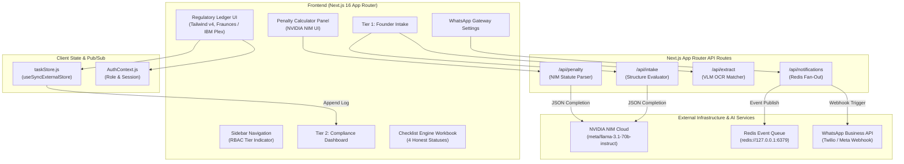
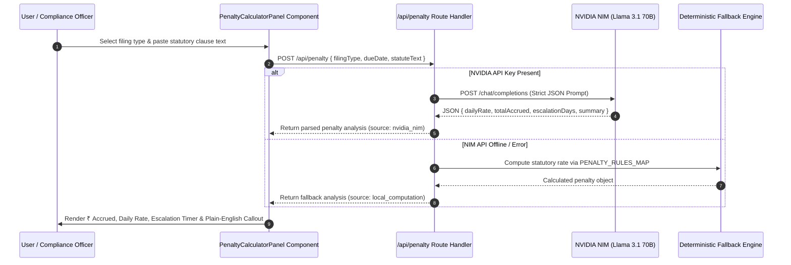
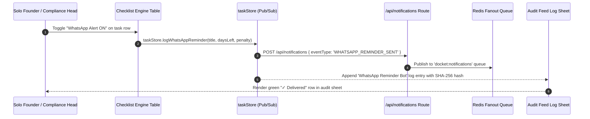
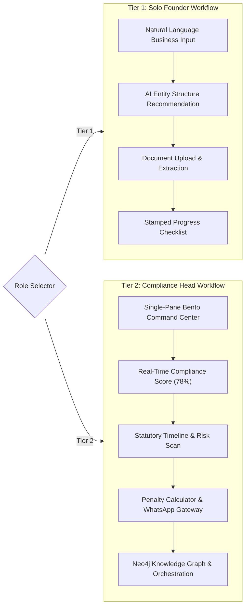

# 📜 Docket — AI-Powered Enterprise Compliance & Regulatory Platform

> **Institutional accuracy for compliance heads. Guided clarity for solo founders.**
> Designed with the **"Regulatory Ledger"** aesthetic — light-mode only, high contrast, serif headings, and monospace audit trails.

---

[](https://nextjs.org/)
[](https://tailwindcss.com/)
[](https://build.nvidia.com/)
[](https://redis.io/)
[](https://react.dev/)

---

## 📑 Table of Contents

- [Overview](#-overview)
- [Design Direction: "Regulatory Ledger"](#-design-direction-regulatory-ledger)
- [Signature Features](#-signature-features)
  - [1. Real-Time Penalty Calculator (NVIDIA NIM)](#1-real-time-penalty-calculator-nvidia-nim)
  - [2. WhatsApp Reminder Gateway](#2-whatsapp-reminder-gateway)
  - [3. Checklist Engine Workbook (4 Honest Statuses)](#3-checklist-engine-workbook-4-honest-statuses)
  - [4. Dual-Tier User Identity (RBAC)](#4-dual-tier-user-identity-rbac)
- [Architecture & System Flowcharts](#-architecture--system-flowcharts)
  - [System Architecture](#system-architecture)
  - [NVIDIA NIM Penalty Calculation Flow](#nvidia-nim-penalty-calculation-flow)
  - [WhatsApp Dispatch & Audit Trail Flow](#whatsapp-dispatch--audit-trail-flow)
  - [Dual-Tier User Workflow](#dual-tier-user-workflow)
- [🎬 Demo Script for Judges](#-demo-script-for-judges)
- [Directory Structure](#-directory-structure)
- [Getting Started](#-getting-started)
- [License](#-license)

---

## 🏛️ Overview

**Docket** is an AI-powered enterprise regulatory & compliance automation platform tailored for Indian corporate governance (Companies Act 2013, CGST Act 2017, Income Tax Act 1961, EPF Act, and Labour Laws).

Unlike generic SaaS platforms with flashy dark modes, purple gradients, or rounded card grids, Docket is built like an institutional legal & accounting ledger. It serves two distinct professional personas:

- **Tier 1 — Solo Founders**: Fast, conversational, guided dossier intake with a stamped progress checklist.
- **Tier 2 — Compliance Heads**: High-density Bento command center, real-time risk gauges, live statutory timeline, printed audit feeds, and Neo4j knowledge graph views.

---

## 🎨 Design Direction: "Regulatory Ledger"

The platform enforces a strict **Light Mode Only** aesthetic:

| System Element | Token / Value | Application |
| :--- | :--- | :--- |
| **Primary Background** | `#FAF9F6` (`bg-paper`) | Off-white paper background across all pages, graphs, and modals. |
| **Card Surface** | `#FFFFFF` (`bg-surface`) | Sharp card containers with hairline borders (`#D8D3C8`). |
| **Primary Ink Text** | `#0F172A` (`text-ink`) | Strong navy contrast for body text and headings. |
| **Single Accent** | `#C77D2E` (`bg-amber`) | Used exclusively for primary actions, active tabs, and risk callouts. |
| **4-State Checklist** | Green `#2F6D4F` / Red `#A33B3B` / Amber `#C77D2E` / Grey `#D8D3C8` | Strict state badges for `Not Started`, `Evidence Uploaded`, `Filed & Verified`, `Overdue`. |
| **Headlines** | **Fraunces** (`font-serif`) | Transitional slab serif giving institutional legal weight. |
| **Body & UI** | **IBM Plex Sans** (`font-sans`) | Clean grotesk (16px base) engineered for legibility. |
| **Data & Timestamps** | **IBM Plex Mono** (`font-mono`) | Monospace for IDs, hashes, financial figures, penalties, and audit feeds. |
| **Borders** | **1px Hairline** (`#D8D3C8`) | 2px max corner radius (`rounded-sm`), zero card drop shadows. |

---

## 🚀 Signature Features

### 1. Real-Time Penalty Calculator (NVIDIA NIM)
- **NVIDIA NIM AI Statute Parser**: Connects to `meta/llama-3.1-70b-instruct` via `/api/penalty` to parse raw statutory clause text (e.g., CGST Act Section 47, Income Tax Act Section 234E) into structured penalty data.
- **Live Accrual Tracking**: Computes exact rupee penalty accrued to date (`₹14,600 accrued`), daily rate (`₹200/day late fee`), and escalation countdown (`escalates to prosecution risk in 11 days`).
- **Statutory Warning Callout**: Styled as a bordered warning notice on the ledger aesthetic with monospace financial metrics.
- **Fallback Engine**: Local deterministic calculation fallback covering 13+ Indian statutory filing types if API is offline.

### 2. WhatsApp Reminder Gateway
- **Per-Task Toggle**: Every obligation row in the Checklist Engine features a prominent `WhatsApp Alert ON/OFF` toggle button.
- **Pre-Filing Cadence**: Configurable dispatch intervals at `30`, `15`, `7`, and `1` day before deadline.
- **Live Message Preview Card**: Renders the exact WhatsApp template formatted with filing name, due date, and current penalty-if-missed.
- **Immutable Audit Trail**: Dispatched reminders automatically append to `taskStore` and Redis event queues, appearing in the live printed audit log sheet.

### 3. Checklist Engine Workbook (4 Honest Statuses)
- **Spreadsheet Ledger Layout**: Section 22 Product Plan official workbook engine with yellow input cells (user entry) and grey formula cells (calculated values).
- **4 Honest Status System**:
  1. `Not Started` (Grey) — No evidence uploaded.
  2. `Evidence Uploaded - Unverified` (Amber) — Evidence uploaded, awaiting SME sign-off.
  3. `Filed & Verified` (Green) — Evidence uploaded AND verified by SME/rule engine (only state safe for audit).
  4. `Overdue` (Red) — Deadline passed without verified evidence (3.0× urgency multiplier).
- **Accrued Penalty & Risk Score Column**: Live rupee exposure calculation per row.

### 4. Dual-Tier User Identity (RBAC)
- **Role Indicator Badge**: Prominently rendered in the sidebar top header (`TIER 1 — FOUNDER` vs `TIER 2 — COMPLIANCE HEAD`).
- **Context-Switching**: One-click demo authentication allows switching between Solo Founder dossier intake and Compliance Head Bento command center.

---

## 📐 Architecture & System Flowcharts

### System Architecture



---

### NVIDIA NIM Penalty Calculation Flow



---

### WhatsApp Dispatch & Audit Trail Flow



---

### Dual-Tier User Workflow



---

## 🎬 Demo Script for Judges

> **Goal:** Demonstrate how Docket solves compliance friction for both non-legal founders and executive compliance officers in under 3 minutes.

1. **Step 1 — Show Overdue Task in Checklist Engine**:
   - Open **Checklist Engine** (`Tab 1: Live Obligations Checklist`).
   - Highlight an overdue filing (e.g. `Form 26Q` or `GSTR-3B`).
   - Point out the **Accrued Penalty** cell (`₹14,600`) and the **WhatsApp Alert ON** toggle.

2. **Step 2 — Open Risk & Penalty Panel**:
   - Click the `₹14,600` accrued penalty button or the top **Risk & Penalty Panel** button.
   - Highlight the hero metric cards: total rupee penalty accrued, daily rate, and the live escalation countdown.
   - Point out the **NVIDIA NIM live statute parser box**: paste a raw statutory clause and show NIM parsing it instantly into plain-English.

3. **Step 3 — Trigger WhatsApp Reminder & Show Audit Trail**:
   - Click **Trigger Test WhatsApp Reminder**.
   - Show the live message preview card in **WhatsApp Gateway** (`Hi Ankit... GSTR-3B is due in 7 days. Penalty if missed: ₹50/day`).
   - Point out the green `WhatsApp Reminder Bot` entry in the live printed Audit Feed.

4. **Closing Pitch Line**:
   > *"Docket doesn't just track compliance — it makes sure the founder actually sees the deadline on WhatsApp before it costs them money."*

---

## 📁 Directory Structure

```
testdoc/
├── app/
│   ├── api/
│   │   ├── auth/ (login & register routes)
│   │   ├── extract/ (document extraction API)
│   │   ├── intake/ (NVIDIA NIM structure evaluator)
│   │   ├── notifications/ (Redis fan-out queue API)
│   │   ├── penalty/ (NVIDIA NIM penalty parser API) [NEW]
│   │   └── query/ (regulatory Q&A API)
│   ├── dashboard/page.jsx (standalone dashboard page)
│   ├── intake/page.jsx (standalone intake page)
│   ├── tasks/page.jsx (standalone tasks page)
│   ├── globals.css (Regulatory Ledger design system & Tailwind v4 @theme)
│   ├── layout.jsx (Root layout with Fraunces & IBM Plex Google Fonts)
│   └── page.jsx (Main SPA shell router)
├── components/
│   ├── Sidebar.jsx (RBAC tier indicator & ledger nav)
│   ├── HeaderNav.jsx (Serif page titles & action buttons)
│   ├── SoloFounderIntake.jsx (Tier 1 guided dossier intake)
│   ├── ComplianceHeadDashboard.jsx (Tier 2 Bento command center)
│   ├── ChecklistEngineWorkbook.jsx (4 Honest Statuses & penalty column)
│   ├── PenaltyCalculatorPanel.jsx (NVIDIA NIM penalty parser) [NEW]
│   ├── WhatsAppReminderSettings.jsx (WhatsApp gateway & preview) [NEW]
│   ├── KnowledgeGraphView.jsx (Off-white graph canvas)
│   ├── OrchestrationTimeline.jsx (Court docket execution trace)
│   ├── TasksView.jsx (Case-file kanban task canvas)
│   ├── AuthModal.jsx (Ledger RBAC login modal)
│   ├── TaskCreateModal.jsx (Task creation dialog)
│   ├── NewProjectModal.jsx (Project initialization dialog)
│   └── NotificationCenterModal.jsx (Redis event simulator & log sheet)
├── lib/
│   ├── AuthContext.js (RBAC auth & session management)
│   ├── mockData.js (Statutory datasets & PENALTY_RULES_MAP)
│   ├── redisClient.js (Redis connection setup)
│   └── taskStore.js (External store & logWhatsAppReminder pub/sub)
├── package.json
└── README.md
```

---

## ⚙️ Getting Started

### Prerequisites
- Node.js 18.x or 20.x
- npm or pnpm
- Optional: Local Redis server running on `redis://127.0.0.1:6379` (for notification fan-out)

### 1. Installation
Clone the repository and install dependencies:
```bash
git clone https://github.com/Sriram-Nambiar/Docket.git
cd testdoc
npm install
```

### 2. Configure Environment Variables
Create a `.env.local` file in the root directory:
```ini
NVIDIA_API_KEY=your_nvidia_nim_api_key_here
NIM_BASE_URL=https://integrate.api.nvidia.com/v1
NIM_MODEL=meta/llama-3.1-70b-instruct
REDIS_URL=redis://127.0.0.1:6379
```

### 3. Run Development Server
```bash
npm run dev
```
Open [http://localhost:3000](http://localhost:3000) in your browser.

### 4. Build for Production
Validate TypeScript types and static page generation:
```bash
npm run build
npm run start
```

---

## 📄 License

Distributed under the MIT License. See `LICENSE` for more information.
