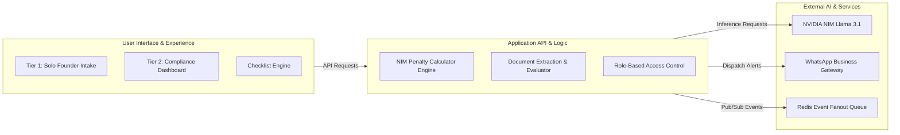

# Block Diagram of the Proposed Solution

This block diagram represents the functional modules of the Docket platform and how they integrate to deliver the proposed compliance solution.

```mermaid
flowchart LR
    subgraph UserInterface [User Interface & Experience]
        A1[Tier 1: Solo Founder Intake]
        A2[Tier 2: Compliance Dashboard]
        A3[Checklist Engine]
    end

    subgraph ApplicationLogic [Application API & Logic]
        B1[NIM Penalty Calculator Engine]
        B2[Document Extraction & Evaluator]
        B3[Role-Based Access Control]
    end

    subgraph ExternalIntegrations [External AI & Services]
        C1[NVIDIA NIM Llama 3.1]
        C2[WhatsApp Business Gateway]
        C3[Redis Event Fanout Queue]
    end

    UserInterface -->|API Requests| ApplicationLogic
    ApplicationLogic -->|Inference Requests| C1
    ApplicationLogic -->|Dispatch Alerts| C2
    ApplicationLogic -->|Pub/Sub Events| C3
```
