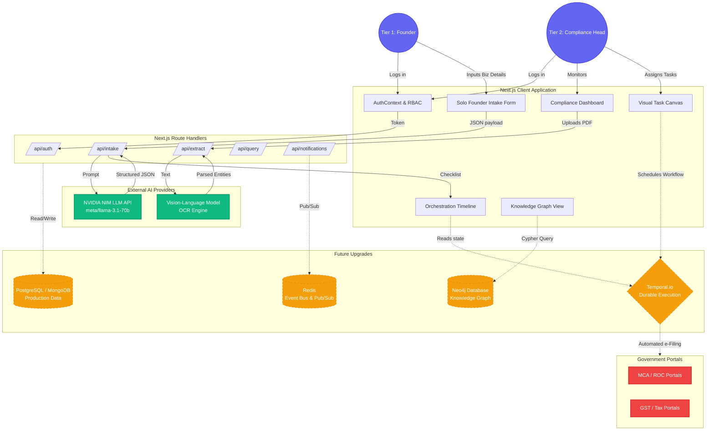

# Docket Data Flow Architecture

Below is the complete Data Flow Diagram for the Docket platform. 

> [!NOTE]
> Modules marked with dashed lines (`-.-`) or labeled **[FUTURE UPGRADE]** indicate components that are architected but require backend infrastructure (Databases, Message Queues, Gov API access) to fully realize beyond the current frontend demo.

### Component Breakdown

1. **User Identity Flow (`AuthContext`)**: Users authenticate and are routed to their respective interfaces based on their Tier (1 or 2).
2. **AI Processing Flow**: When a user inputs natural language, it travels through the Next.js API layer out to NVIDIA's inference endpoints, returning structured JSON that populates the React state machines (Checklist Engine).
3. **[FUTURE UPGRADE] Durable Execution**: The `Temporal.io` worker cluster will handle long-running background tasks, such as waiting 30 days for a signature, and then firing off a payload to the Government API.
4. **[FUTURE UPGRADE] Graph Database**: True Neo4j integration will allow querying deep relationships (e.g., "Show me all forms required by the MCA that apply to companies with >100 employees").
5. **[FUTURE UPGRADE] Government API Integration**: The ultimate upgrade involves replacing manual form downloading with direct authenticated `POST` requests to Government e-Filing portals.
