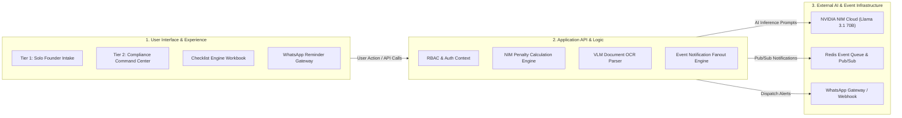
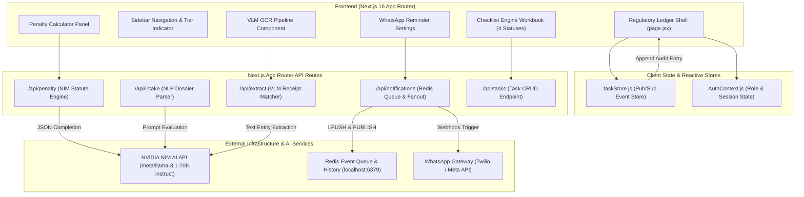
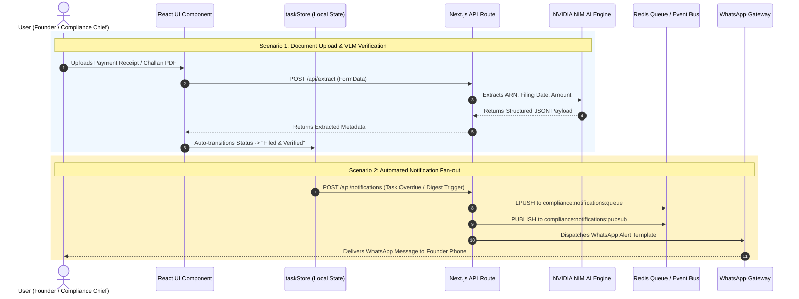
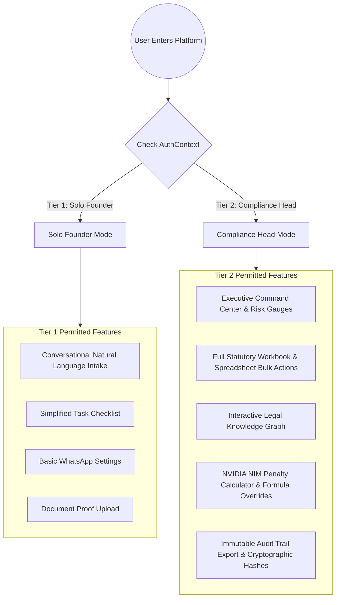

# 🏗️ Docket — System Architecture & Block Diagrams

This document presents the visual system architecture, block diagrams, data flow lifecycles, and component dependency structures for **Docket**—the AI-powered enterprise regulatory & compliance automation platform.

---

## 📑 Diagrams Included

1. [High-Level Functional Block Diagram](#1-high-level-functional-block-diagram)
2. [Full System Architecture Diagram](#2-full-system-architecture-diagram)
3. [Data Flow & Execution Lifecycle Diagram](#3-data-flow--execution-lifecycle-diagram)
4. [Component & State Store Dependency Map](#4-component--state-store-dependency-map)
5. [Role-Based Access Control (RBAC) Flow Diagram](#5-role-based-access-control-rbac-flow-diagram)

---

## 1. High-Level Functional Block Diagram

This block diagram represents the primary functional modules of Docket and how user interactions flow through the application logic to external services.

---

## 2. Full System Architecture Diagram

This detailed architectural diagram details the interactions between the Next.js 16 Client, `useSyncExternalStore` state, App Router Server Routes, and backend services.

---

## 3. Data Flow & Execution Lifecycle Diagram

This diagram illustrates how data flows from user input (document uploads, natural language prompts) down to automated status verification and notification delivery.

---

## 4. Component & State Store Dependency Map

Map showing how individual React UI components communicate through `lib/taskStore.js` and `lib/AuthContext.js`.

```mermaid
graph TD
    App["app/page.jsx (Application Shell)"]

    subgraph AuthLayer ["Authentication & State Context"]
        AuthCtx["lib/AuthContext.js"]
        TaskStore["lib/taskStore.js"]
    end

    subgraph Navigation ["Layout Components"]
        HeaderNav["components/HeaderNav.jsx"]
        Sidebar["components/Sidebar.jsx"]
    end

    subgraph Views ["Main Feature Views"]
        IntakeView["components/SoloFounderIntake.jsx"]
        DashView["components/ComplianceHeadDashboard.jsx"]
        WorkbookView["components/ChecklistEngineWorkbook.jsx"]
        PenaltyView["components/PenaltyCalculatorPanel.jsx"]
        WhatsAppView["components/WhatsAppReminderSettings.jsx"]
        VLMView["components/VlmOcrPipeline.jsx"]
        GraphView["components/KnowledgeGraphView.jsx"]
    end

    App --> AuthCtx
    App --> TaskStore
    App --> HeaderNav
    App --> Sidebar

    HeaderNav --> AuthCtx
    Sidebar --> AuthCtx

    App --> IntakeView
    App --> DashView
    App --> WorkbookView
    App --> PenaltyView
    App --> WhatsAppView
    App --> VLMView
    App --> GraphView

    IntakeView --> TaskStore
    WorkbookView --> TaskStore
    DashView --> TaskStore
    WhatsAppView --> TaskStore
```

---

## 5. Role-Based Access Control (RBAC) Flow Diagram

Shows permission routing between Tier 1 (Solo Founder) and Tier 2 (Compliance Chief) personas.

---

*Architectural Documentation generated for Docket AI Compliance Platform.*
