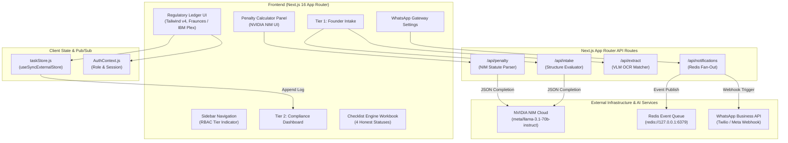

# System Architecture

The following diagram illustrates the overarching system architecture for the Docket platform, detailing the interactions between the frontend client, state management, API routes, and external infrastructure.

